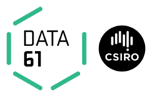

  

  

  
  

  

  
  

  

# Queensland Functional Programming Lab

  <h1>Write software that works</h1>
  We are a software development team, committed to producing quality software and helping others do same.

  <h2>Encapsulation, data hiding, modularity</h2>

Functional Programming fulfills the broken promises of OO. Software as components.

  <h2>Correctness, reliability, verification</h2>

 
Functional Programming builds on the shoulders of giants of mathematics to enable reliable software verification tools.

See [this week's costly software calamity](./posts/2017-week-32-software-calamity/).
 

  <h2>Education, idea sharing, collaborative betterment</h2>

 
If Functional Programming is so much better, why isn't everyone using it yet? Because you haven't yet knocked on [our door](./contact).

  <h3>What we are working on</h3>

Our team is committed to exploiting the benefits of Functional Programming, and
assisting others in doing same.

We have specific interests in:

* programming language tools and particularly, in assisting with the problems
  associated with legacy programming languages, such as python and javascript.

* numerical computing and associated tools.

* reflex as an implementation of Functional Reactive Programming.

* conducting hands-on Functional Programming courses, targetted toward industry
programmers who seek to take advantage of Functional Programming in their work.

See our [projects](./projects) for more.

  <h3>Blog posts</h3>

The most recent blog posts are:
$partial("templates/post-list.html")$

The whole backlog is available from the [archives](./archive).
